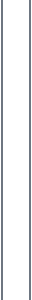

<h2>Featured Projects</h2>
<table width="100%" border="2" frame="box" rules="none">

<tr>

<!-- OOO -->
<td width="47%" valign="top" height="285">

 

<strong>
<a href="https://github.com/SeanS4/rv32im-out-of-order-processor">
Out-of-Order RV32IM Processor
</a>
<a href="https://github.com/SeanS4/rv32im-out-of-order-processor">
&#x1F4CE;&#xFE0E;
</a>
</strong>

 
 

Synthesizable RV32IM core with register renaming, dynamic scheduling,
an LSQ/ROB, and precise retirement.

  

 

<kbd>SystemVerilog</kbd>
<kbd>RISC-V</kbd>

  

<kbd>RTL</kbd>
<kbd>OoO</kbd>

 

</td>

<!-- STRONG VERTICAL DIVIDER -->
<td width="6%" valign="middle" align="center">

</td>

<!-- TETRIS -->
<td width="47%" valign="top" height="285">

 

<strong>
<a href="https://github.com/SeanS4/bluetooth-fpga-tetris">
Bluetooth-Controlled FPGA Tetris
</a>
<a href="https://github.com/SeanS4/bluetooth-fpga-tetris">
&#x1F4CE;&#xFE0E;
</a>
</strong>

 
 

FPGA Tetris with BRAM-backed state, HDMI output,
and ESP32 Bluetooth controls.

  

 

<kbd>SystemVerilog</kbd>
<kbd>FPGA</kbd>
<kbd>BRAM</kbd>

  

<kbd>HDMI</kbd>
<kbd>ESP32</kbd>

 

</td>

</tr>

<!-- STRONG HORIZONTAL DIVIDER -->
<tr>
<td colspan="3" height="24">

</td>
</tr>

<tr>

<!-- OS -->
<td width="47%" valign="top" height="285">

 

<strong>
<a href="https://github.com/SeanS4/unix-like-operating-system">
Unix-Like Operating System
</a>
<a href="https://github.com/SeanS4/unix-like-operating-system">
&#x1F4CE;&#xFE0E;
</a>
</strong>

 
 

RISC-V OS with user processes, Sv39 virtual memory,
scheduling, drivers, and a filesystem.

  

 

<kbd>C</kbd>
<kbd>Assembly</kbd>
<kbd>RISC-V</kbd>

  

<kbd>Sv39</kbd>
<kbd>QEMU</kbd>

 

</td>

<!-- STRONG VERTICAL DIVIDER -->
<td width="6%" valign="middle" align="center">

</td>

<!-- ASIC -->
<td width="47%" valign="top" height="285">

 

<strong>
<a href="https://github.com/SeanS4/risc-v-asic-physical-design">
RISC-V ASIC Physical Design
</a>
<a href="https://github.com/SeanS4/risc-v-asic-physical-design">
&#x1F4CE;&#xFE0E;
</a>
</strong>

 
 

32-bit bit-sliced RISC-V datapath with custom standard cells
and Cadence Innovus physical design.

  

 

<kbd>Virtuoso</kbd>
<kbd>Innovus</kbd>
<kbd>FreePDK45</kbd>

  

<kbd>VLSI</kbd>
<kbd>ASIC</kbd>

 

</td>

</tr>

</table>
