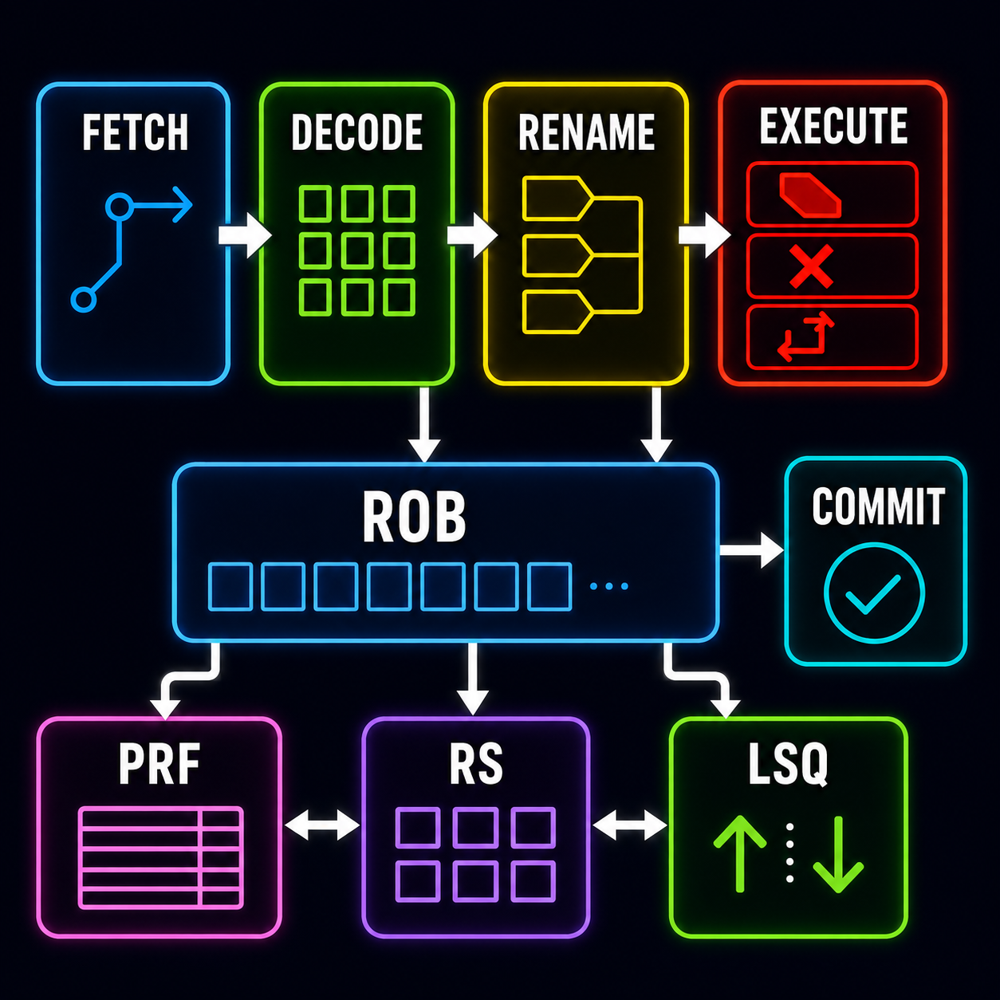

<h2>Featured Projects</h2>

<table width="100%">
<tr>
<td width="18%" valign="middle">

</td>
<td width="29%" valign="middle">
<strong><a href="https://github.com/SeanS4/rv32im-out-of-order-processor">Out-of-Order RV32IM Processor</a></strong>
  
32-bit RISC-V processor with register renaming, dynamic scheduling, and precise retirement.
  
SystemVerilog • RISC-V • RTL • OOO
</td>
<td width="6%"></td>
<td width="18%" valign="middle">

</td>
<td width="29%" valign="middle">
<strong><a href="https://github.com/SeanS4/bluetooth-fpga-tetris">Bluetooth-Controlled FPGA Tetris</a></strong>
  
Hardware Tetris implementation with Bluetooth controls and real-time HDMI video output.
  
SystemVerilog • FPGA • ESP32 • HDMI
</td>
</tr>
<tr>
<td colspan="5" height="30"></td>
</tr>
<tr>
<td width="18%" valign="middle">

</td>
<td width="29%" valign="middle">
<strong><a href="https://github.com/SeanS4/unix-like-operating-system">Unix-Like Operating System</a></strong>
  
RISC-V operating system with processes, virtual memory, device drivers, and a filesystem.
  
C • Assembly • RISC-V • QEMU
</td>
<td width="6%"></td>
<td width="18%" valign="middle">

</td>
<td width="29%" valign="middle">
<strong><a href="https://github.com/SeanS4">RISC-V ASIC Physical Design</a></strong>
  
Custom-cell and automated physical design of a 32-bit bit-sliced RISC-V processor.
  
VLSI • Cadence • Innovus • FreePDK45
</td>
</tr>
</table>
