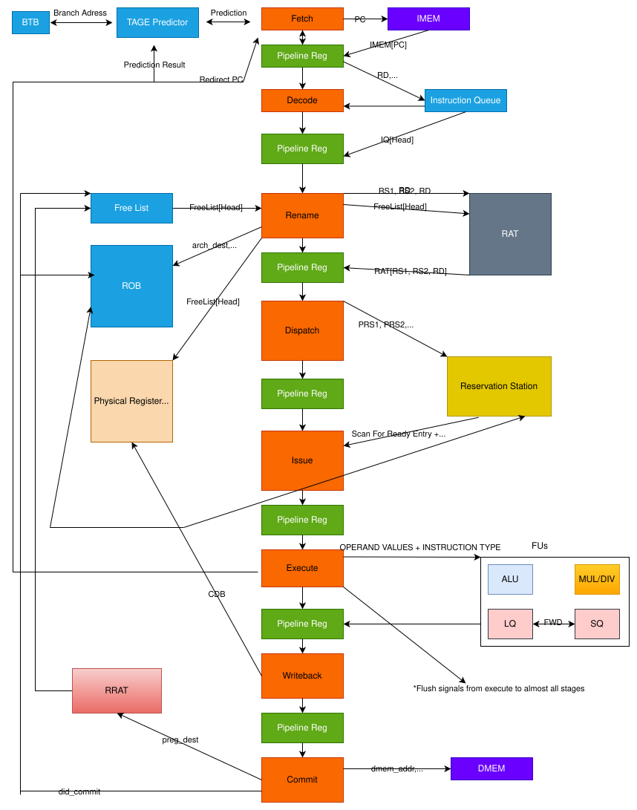

## Featured Projects

  
  &nbsp;&nbsp;&nbsp;&nbsp;&nbsp;&nbsp;
  
   
  <a href="https://github.com/SeanS4/rv32im-out-of-order-processor"><b>Out-of-Order RV32IM Processor</b></a>
  &nbsp;&nbsp;&nbsp;&nbsp;&nbsp;&nbsp;
  <a href="https://github.com/SeanS4/bluetooth-fpga-tetris"><b>Bluetooth-Controlled FPGA Tetris</b></a>

  
  &nbsp;&nbsp;&nbsp;&nbsp;&nbsp;&nbsp;
  
   
  <a href="https://github.com/SeanS4/unix-like-operating-system"><b>Unix-Like Operating System</b></a>
  &nbsp;&nbsp;&nbsp;&nbsp;&nbsp;&nbsp;
  <a href="https://github.com/SeanS4/riscv-asic-physical-design"><b>RISC-V ASIC Physical Design</b></a>

