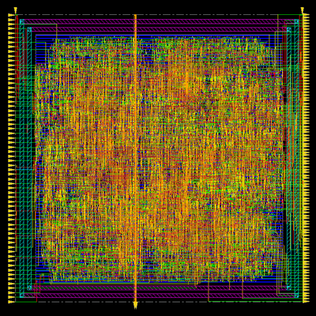
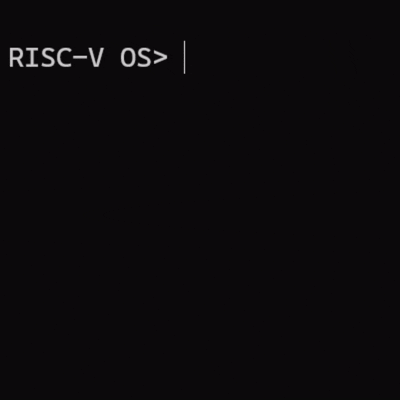

<h2>Featured Projects</h2>
<table width="100%">

<tbody>
<tr>

<td width="50%" valign="top">

 
<u><a href="https://github.com/SeanS4/risc-v-asic-physical-design">RISC-V Processor Physical Design&nbsp;&#x1F4CE;&#xFE0E;</a></u><a href="https://github.com/SeanS4/risc-v-asic-physical-design">RISC-V Processor Physical Design&nbsp;&#x1F4CE;&#xFE0E;</a></u>
 

Bit-sliced RISC-V datapath with custom standard cells and automated physical design in Cadence Innovus.
 
<kbd>Virtuoso</kbd> <kbd>Innovus</kbd> <kbd>FreePDK45</kbd> <kbd>VLSI</kbd> <kbd>ASIC</kbd>
</td>

<td width="50%" valign="top">

 
<u><a href="https://github.com/SeanS4/bluetooth-fpga-tetris">Bluetooth-Controlled FPGA Tetris&nbsp;&#x1F4CE;&#xFE0E;</a></u>
 

FPGA Tetris with BRAM-backed board state, HDMI output, and ESP32 Bluetooth controls.
 
<kbd>SystemVerilog</kbd> <kbd>FPGA</kbd> <kbd>BRAM</kbd> <kbd>HDMI</kbd> <kbd>ESP32</kbd>
</td>

</tr>
</tbody>

<tbody>
<tr>

<td width="50%" valign="top">

 
<u><a href="https://github.com/SeanS4/unix-like-operating-system">Unix-Like Operating System&nbsp;&#x1F4CE;&#xFE0E;</a></u>
 

RISC-V OS with user processes, Sv39 virtual memory, system calls, scheduling, drivers, and a filesystem.
 
<kbd>C</kbd> <kbd>Assembly</kbd> <kbd>RISC-V</kbd> <kbd>Sv39</kbd> <kbd>QEMU</kbd>
</td>

<td width="50%" valign="top">

 
<u><a href="https://github.com/SeanS4/rv32im-out-of-order-processor">Out-of-Order Processor&nbsp;&#x1F4CE;&#xFE0E;</a></u>
 

RV32IM core with register renaming, dynamic scheduling, an LSQ/ROB, and precise in-order retirement.
 
<kbd>SystemVerilog</kbd> <kbd>RISC-V</kbd> <kbd>RTL</kbd> <kbd>OoO</kbd>
</td>

</tr>
</tbody>

</table>
